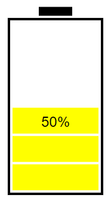

# SVG-BatteryGauge
A simple SVG/Javascript battery gauge which displays percentage charge given a voltage range and a voltage.  
## Initialisation  
To initialise a new BatteryGauge, you must declare it as an object with the parameters as below:
```
let battery = new BatteryGauge(Div, Options);
```
* Div - The div object in your HTML code that you are drawing to.  
* Options - An object containing the settings for your battery. These settings are as follows:
    * scale - The scale of the battery to be drawn.
    * divisions - The number of battery bars.
    * chargedVoltage - The voltage of the battery when fully charged.
    * dischargedVoltage - The voltage of the battery when fully discharged.
    * strokeWidth - The thickness of the outline of the battery.
    * strokeColour - The colour of the outline of the battery.
    * bgColour - The background colour of the battery

For example:
```
let div = document.getElementById("battery");
let options = {
    scale : 2,
    divisions : 5,
    chargedVoltage : 12.7,
    dischargedVoltage : 11.5,
    strokeWidth : 0.5,
    strokeColour : 'black',
    bgColour : 'white'
}
```  
## Drawing the battery  
Once you have declared your battery object, you may draw the battery using the update function as below:  
```
battery.update(voltage)
```
* voltage - The voltage of your battery  
  
For example, with the range given in the first example when initialising the BatteryGauge object, a voltage value of 12.1 will display the following:  
