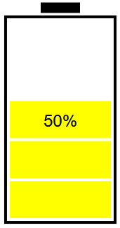

# SVG-BatteryGauge
A simple SVG/Javascript battery gauge which displays percentage charge given a voltage range and a voltage.  
## Initialisation  
To initialise a new BatteryGauge, you must declare it as an object with the parameters as below (The last 3 parameters are optional):
```
let battery = new BatteryGauge(Scale, Divisions, ChargedVoltage, DischargedVoltage, Div, StrokeWidth, StrokeColour, BgColour);
```
* Scale - How much you want to scale the battery image by  
* Divisions - The number of battery bars  
* ChargedVoltage - The voltage of the battery when it is full  
* DischargedVoltage - The voltage of the battery when it is empty  
* Div - The div object in your HTML code that you are drawing to  
* StrokeWidth - The width of the outline of the battery (default is 0.5)  
* StrokeColour - The colour of the outline of the battery (default is black)
* BgColour - The background colour of the rectangle encapsulating the battery bars (default is white)  
  
For example:
```
let div = document.getElementById("yourDivNameHere");
let battery = new BatteryGauge(2, 6, 12.7, 11.5, div, 1, 'red','blue');
```  
## Drawing the battery  
Once you have declared your battery object, you may draw the battery using the update function as below:  
```
battery.update(voltage)
```
* voltage - The voltage of your battery  
  
For example, with the range given in the first example when initialising the BatteryGauge object, a voltage value of 12.1 will display the following:  
